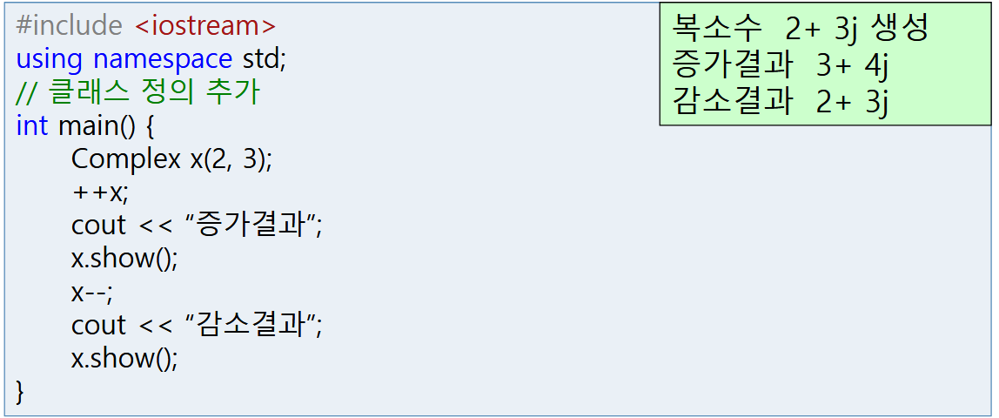

# LINUX 프로그래밍 (25/11/10)

## C++ 7-4장

### 1. 실수부(real)와 허수부(img)를 멤버변수로 갖는 복소수(Complex) 클래스를 아래 결과가 나오도록 구현하시오.(연산자함수를 멤버함수로 구현)

실행 결과

### 2. 실수부(real)와 허수부(img)를 멤버변수로 갖는 복소수(Complex) 클래스를 아래 결과가 나오도록 구현하시오. (연산자함수를 프렌드 함수로 구현)

실행 결과

### 3. 아래 결과처럼 나오도록 Power 클래스를 정의하시오.

실행 결과

### 4. 366~372페이지 문제 중에서 1,2,3,4,5번 중에서 3문제를 풀어서 제출하시오.

문제 1

다음 연산을 통해 공짜 책인지를 판별하도록 ! 연산자를 작성하라.

실행 결과

문제 2

다음 연산을 통해 책의 제목을 사전 순으로 비교하고자 한다. < 연산자를 작성하라.

실행 결과

문제 3

다음 main() 에서 Color 클래스는 3요소(빨강, 초록, 파랑)로 하나의 색을 나타내는 클래스이다. + 연산자로 색을 더하고, == 연산자로 색을 비교하고자 한다. 실행 결과를 참고하여 Color 클래스와 연산자, 그리고 프로그램을 완성하라.

실행 결과

