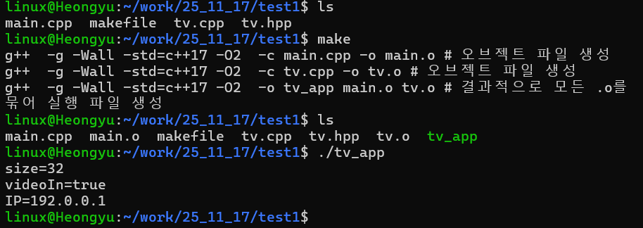

# LINUX 프로그래밍 (25/11/17)

## C++ 8-2장

### 1. 예제 8-3에서 SmartTV 객체 htv가 생성될 때 자동으로 호출되는 생성자를 순서대로 자세히 설명하시오.
htv 생성 시 지정된 인수가 각 생성자에 어떻게 전달되는지도 자세히 설명하시오.

htv 객체 생성 → SmartTV(string ipAddr, int size)를 호출 → 기본 클래스 생성자로  WideTV(size, true) 호출 → WideTV(int size, bool videoIn) 호출 → 기본 클래스 생성자로 TV(size) 호출

실행 결과

### 2. 예제 8-3에서 다음 결과가 나오도록 코드를 수정해보시오.
각 클래스에 생성자와 멤버변수 설정함수를 추가해야 함.

실행 결과

### 3. 위치좌표(x, y)를 멤버로 갖는 Shape클래스를 선언하고 이를 상속한 파생클래스 Circle, Rect, Triangle 클래스를 작성하시오. Shape의 멤버 변수는 private로 선언할 것
파생클래스 생성자를 정의할때 호출할 기본클래스의 생성자를 명시적으로 지정할 것

실행 결과

### 4. 418~424페이지 문제 중에서 1,2,3,4번 중에서 2문제를 풀어서 제출하시오.

문제 3 

다음 main() 함수가 실행되도록 Point 클래스를 상속받은 ColorPoint 클래스를 작성하고, 전체 프로그램을 완성하라.

실행 결과

문제 4

다음 main() 함수가 실행되도록 Point 클래스를 상속받은 ColorPoint 클래스를 작성하고, 전체 프로그램을 완성하라.

실행 결과

