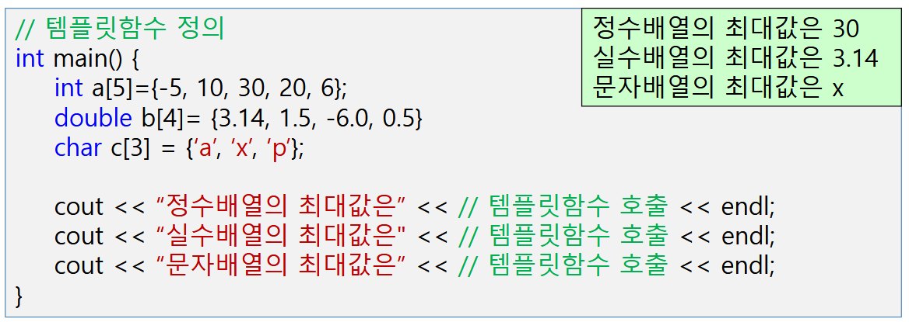

# LINUX 프로그래밍 (25/11/20)

## C++ 10-1장

### 1. 크기가 n인 배열에서 최대값을 구하여 리턴하는 함수(getmax)를 템플릿 함수로 정의하여 다음 메인 함수가 작동하도록 하시오.(예제10-3 참고)

실행 결과

### 2. 다음 프로그램이 실행결과처럼 동작하도록 코드를 수정하시오.
힌트 : Circle객체에 대한 > 연산자 함수 정의 필요

실행 결과

